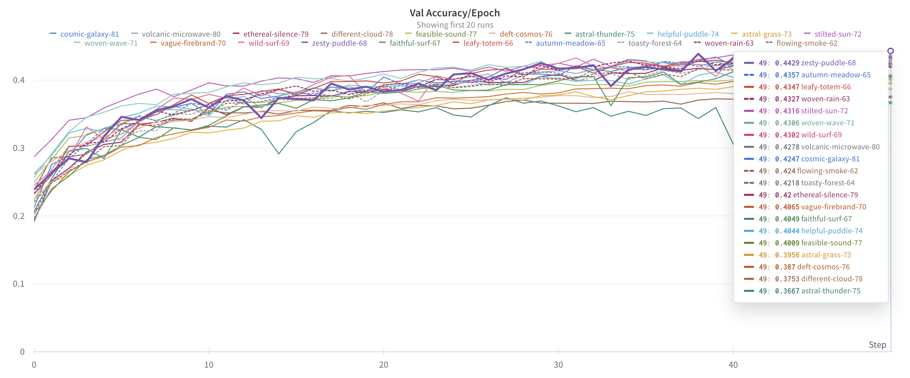

# ATNN - Assignment 5
Wandb: https://wandb.ai/atnn-2023/atnn-2023-lab5?workspace=user-andreilapusneanu2001

Expected number of points: 6 (1, 2, 3a, 3b, 3c, 4)

- Results
    - Optimiser: SGD
        - LR 0.05 -> Validation Acc: 0.4121
        - LR 0.10 -> Validation Acc: 0.4216
        - LR 0.15 -> Validation Acc: 0.4357
    - Optimiser: SGD
        - LR 0.0001 -> Validation Acc: 0.4085
        - LR 0.0005 -> Validation Acc: 0.4344
        - LR 0.001 -> Validation Acc: 0.4239
    - Optimiser: RMSProp
        - LR 0.0001 -> Validation Acc: 0.3933
        - LR 0.001 -> Validation Acc: 0.4004
        - LR 0.005 -> Validation Acc:  0.37
    - Optimiser: Adagrad
        - LR 0.05 -> Validation Acc: 0.3939
        - LR 0.01 -> Validation Acc: 0.393
        - LR 0.05 -> Validation Acc: 0.382
    - Optimiser: SGD with SAM
        - LR 0.1 -> Validation Acc: 0.4218
        - LR 0.15 -> Validation Acc: 0.4357
        - LR 0.2 -> Validation Acc: 0.4347

After trying multiple configurations, the average validation accuracy was above 0.4, with the highest reaching values of 0.44

The evolution of Validation Accuracy for the last 10 runs:
