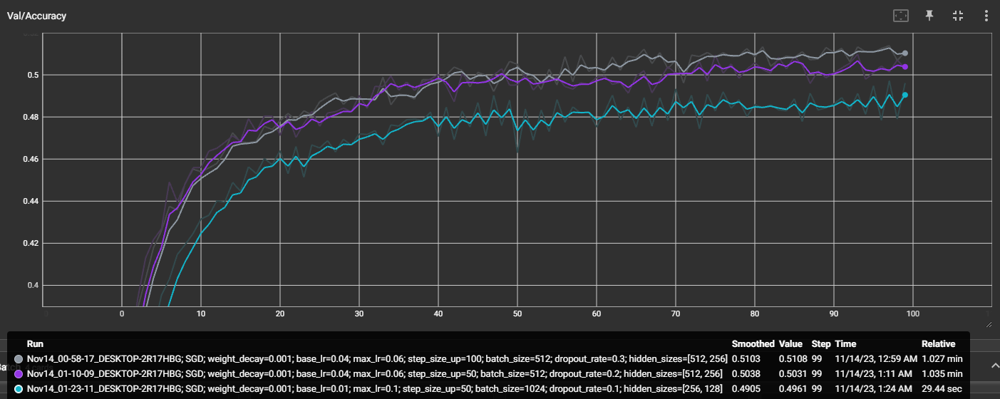
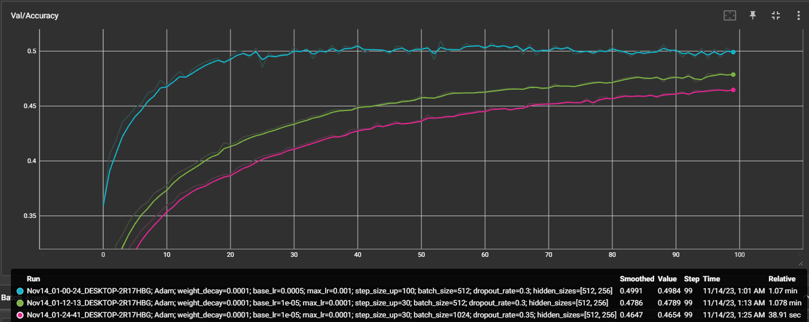
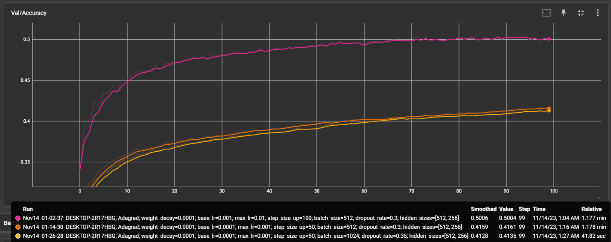
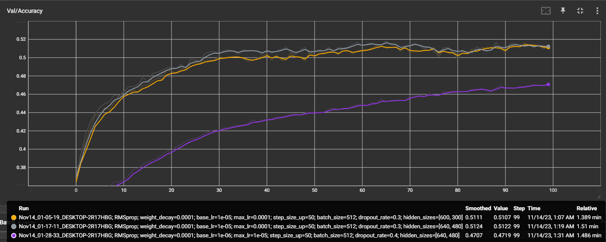

## Lab 

***
WANDB link: [WANDB](https://wandb.ai/arseneandreea08/projects)

Regarding **Tensorboard** runs, the ones in the `runs` folder are the ones used for the 3 chosen configs (for each optimizer), while all the old experiments are in the `old_runs` folder

***

Best accuracy:
- Obtained with `SGD` or `RMSProp`, reliably achieving over 50% stable accuracy on the validation dataset. For `Adam` and `Adagrad`, the accuracy still lays around 50% but is not as reliable.

Key insights:

- Having two hidden layers seems to perform better than having a single hidden layer or more than two.
- One of the key factors in achieving over 50% accuracy was adequatly sizing the hidden layers (512, 256)
- Cyclic learning rate, dropout and weights decay techniques help with overfitting
- Using cyclic learning rate with an interval too big might give us bigger spikes in accuracy but the accuracy will vary more and will not be consistently high
- ReLU activation function performs better than other functions such as Sigmoid, SeLU, LeakyReLU etc.

Screenshots:

SGD

Adam

Adagrad

RMSProp
