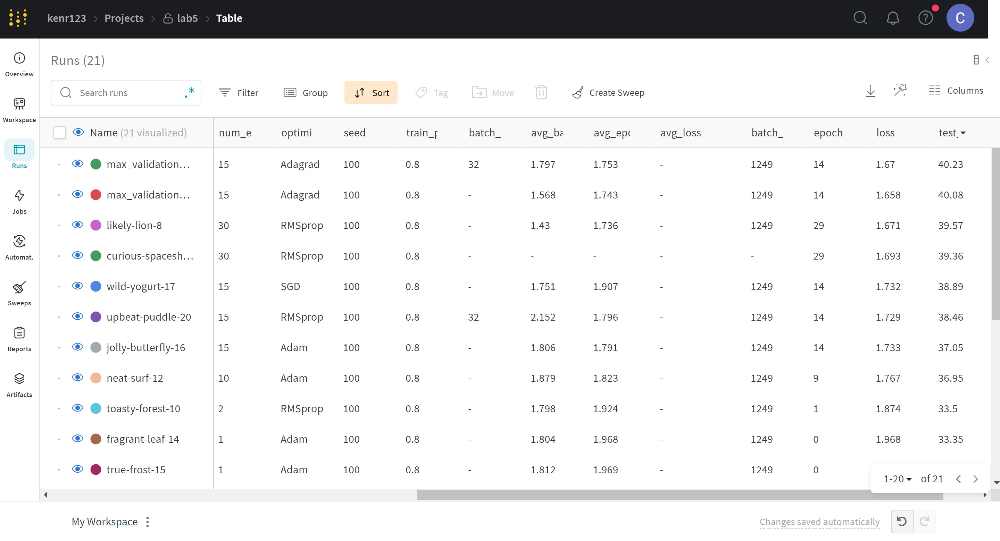

# Solution details

Weight and Biases latest runs: [here](https://wandb.ai/kenr123/lab5/table?workspace=user-zero6305)
Tensorboard logs available locally in `tensorboard_logs_out/`: train and eval folders

```tensorboard --logdir .\tensorboard_logs_out\eval```
```tensorboard --logdir .\tensorboard_logs_out\train```

The following parameters yielded the "best" results:
Run named 'max_validation_Accuracy' from [here](https://wandb.ai/kenr123/lab5/table?workspace=user-zero6305)

Test data validation accuracy: 40.23%
Optimizer: Adagrad
Learning rate: 0.01
Batch size: 32
Epochs: 15
Model norm: 0.9

Results by configuration





