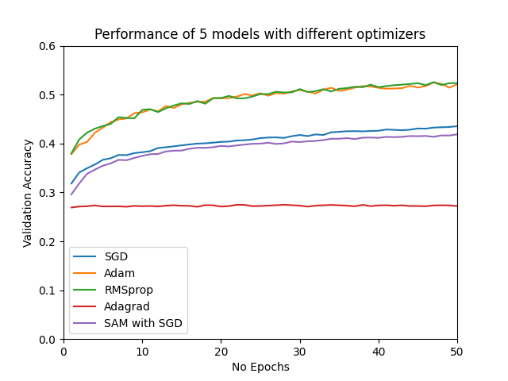

From the previous homework ,i adapted the training pipeline in order to log data in
Tensorboard as well as allow for sweeps using Weights And Biases for fine tuning according to
points 1) and 2).

I also extended model.py in order to allow for dropout,ELU units,BatchNorm and Skip Connections.
Since i didn't see any significant improvement,i ended up not using skip connections.

From my attempts,i ended up with the transformers for the training set:
v2.RandomHorizontalFlip(),v2.GaussianBlur(3)

I also applied a normalization of the 3 channels (RGB) before applying v2.Grayscale since it improved the accuracy
more than making it v2.Grayscale,then normalizing.

Chose to have a dropout rate for each layer equal to 0.15 and no connections.

For each of the five optimizers,i called a sweep for the hyper parameters of the optimizers in order to see the
validation accuracy obtained and to see the impact of each hyper parameter.Based on the values of the best run from each sweep,i then
also modified a bit the parameters and saved the remaining models.

The models left in the runs/train are the ones fine tuned using sweeps,and in the runs/previous
are some other models.

Links to sweeps for each optimizer(10 runs each):
https://wandb.ai/hugs-for-bugs/H5%20SGD%20Fine%20Tuning?workspace=user-remus123

https://wandb.ai/hugs-for-bugs/H5%20Adam%20Fine%20Tuning/overview?workspace=user-remus123

https://wandb.ai/hugs-for-bugs/H5%20RMSprop%20Fine%20Tuning/overview?workspace=user-remus123

https://wandb.ai/hugs-for-bugs/H5%20Adagrad%20Fine%20Tuning/overview?workspace=user-remus123

https://wandb.ai/hugs-for-bugs/H5%20SAM%20with%20SGD%20Fine%20Tuning/overview?workspace=user-remus123

Results:
The best model is RMSProp followed by Adam,both obtaining an accuracy over 50%.

Expected Points: 6-7

