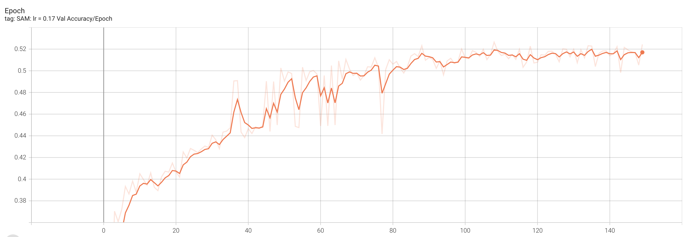

## Homework 5

Weights and Biases: https://wandb.ai/atnn/atnn_homework5?workspace=user-analupoaea

Tensorboard Logs: [Logs](./runs) - I added the logs only from the last run for easier visualization.

I tried multiple configurations for each optimizer required in the assignment. The top 3 configurations for each optimizer can be found in model_configs list, in [main file](./main.py).

In order to increase the accuracy and to avoid overfitting, I used Dropout layers and Batch Normalization.

The highest accuracy on the validation dataset was achieved using the SAM optimizer with a learning rate of 0.17, exceeding 0.5, as it can be seen in the graph below.

Expected points: 7 - as I completed all the mandatory requirements.