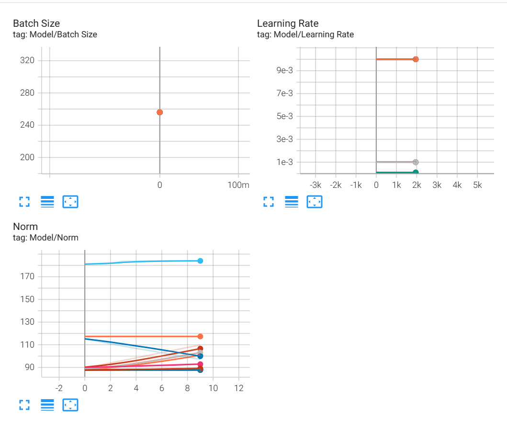
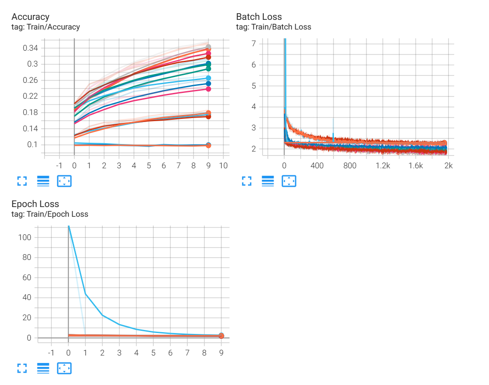
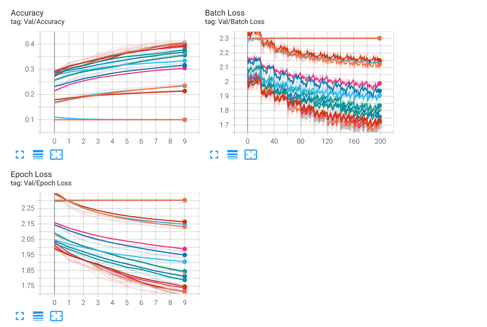
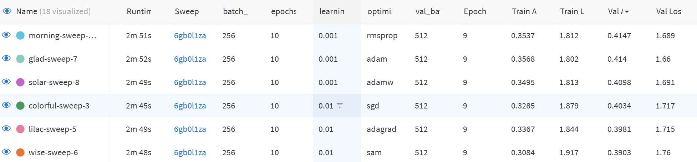
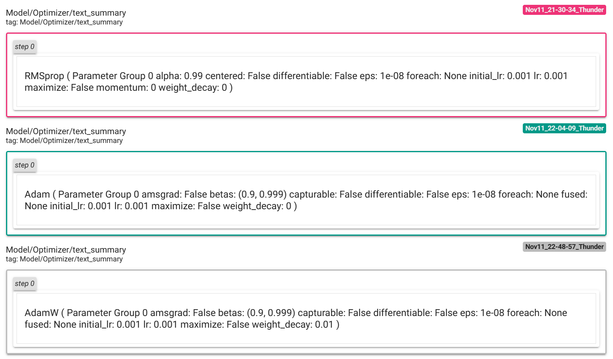
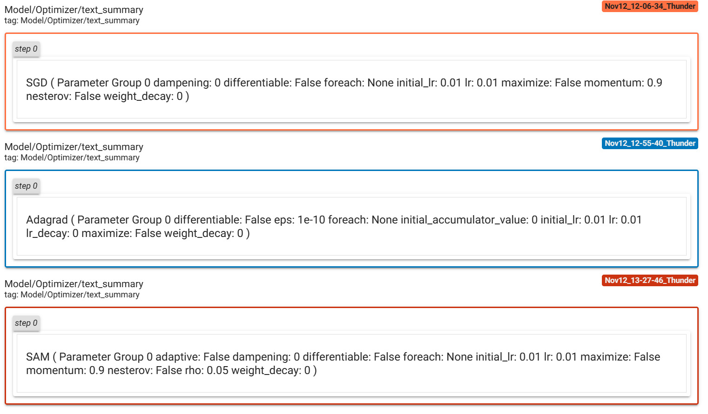
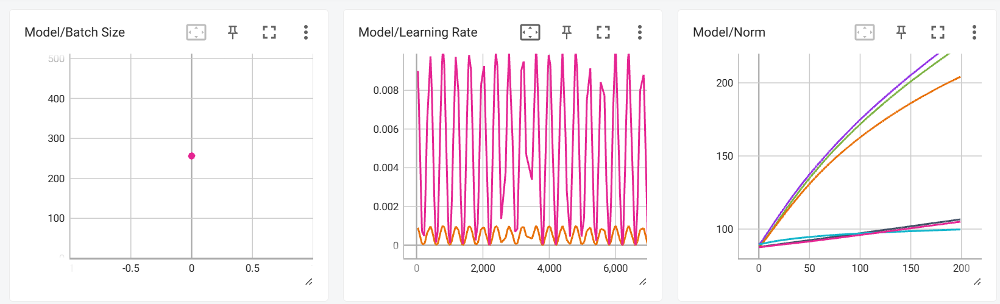
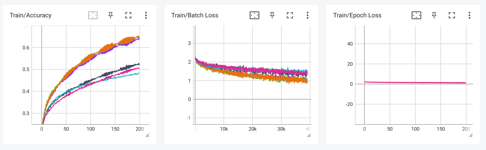
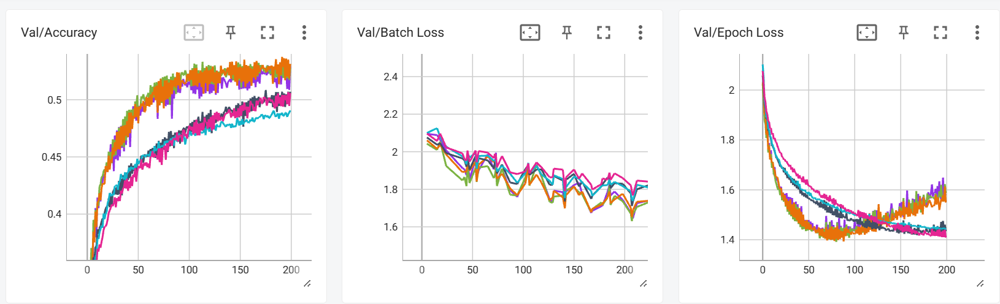

## Solution

CIFAR-10 dataset additional transforms:

    - Normalize the grayscale images based on the mean and standard deviation of the grayscale transform dataset;
    - RandAugment in order to augment the dataset and prevent overfitting;
    - the transforms applied on the train dataset are split in 2 in order to not cache the random transforms;

The model is `EvolvedMLP` and is composed of:

    - input layer: 784
    - hidden layer: 400
    - hidden layer: 784
    - hidden layer: 100
    - output layer: 10

    - the activation function is ReLU;
    - there is a dropout layer after the second 784 hidden layer;
    - there is a skip connection added to the second 784 hidden layer;
    - the initialization of the layers is He;

The pipeline takes into account:

    - the possibility of adding a 2-step optimizer like SAM;
    - a learning rate scheduler;
    - logging metrics both with tensorboard and wandb;

 

The `task_searching method` is used to iterate with wandb through a configuration that defines a grid search for 6 optimizers, each with 3 different learning rate configurations.

The results can be observed at the following wandb webpage, which include Train/Validation Accuracy/Loss and the number of epochs plotted: https://wandb.ai/pricoptudor/Homework5_Solution

The best configurations can be seen and sorted based on the hyperparameters desired at the following link: https://wandb.ai/pricoptudor/Homework5_Solution/table

For the hypertuning process the number of epochs is lower (10), as it is a time-consuming process. The best configurations are then runned with a higher number of epochs (200) inside the `task_solving method`.

Running wandb tuning:

=> the best configs:

 

Running the best configs:

- the best configs:

- the results:

 

As it can be seen the results are as following: 

- rmsprop, 0.001: train - 0.6365 / val - 0.5293

- adam, 0.001: train - 0.6467 / val - 0.5276

- adamw, 0.001: train - 0.6422 / val - 0.5313

- sgd, 0.01: train - 0.5194 / val - 0.507

- adagrad, 0.01: train - 0.4835 / val - 0.4906

- sam, 0.01: train - 0.5028 / val - 0.5058

=> maximum accuracy threshold reached: 50%

 

The expected number of points:

- task 1: complete 1p
- task 2: complete 1p
- task 3: complete 1p + 1p + 1p
- task 4: complete 1p
- task 5: complete 1p
- bonus 1&2: incomplete
