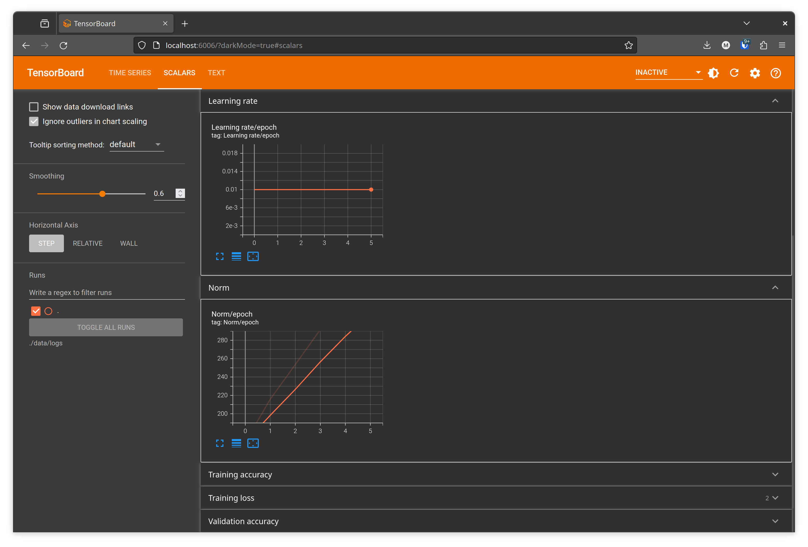

# ATNN: homework 5

## Description

This project contains the solution for homework 5. The solution relies on the following:
- `pytorch`
- `pytorch-torchvision`
- `wandb`
- `tensorboard`
- [a premade implementation of SAM](https://github.com/davda54/sam)

The project _aims_ to be easy to read, building on top of classes in order to separate concerns.

## Project structure

The project is split in the following format:
- `main.py` - the main program
- `run_sweep.sh` - run the program
- `run_tensorboard.sh` - start Tensorboard
- `nn/*` - neural network code
- `util/*` - timers, utilities
- `docs/*` - pictures
- `data/logs/*` - Tensorboard logs
- `wandb/*` - Weights & Biases data

## Visualisations

Most of the visualisations can be checked on my Weights & Biases project here: [link](https://wandb.ai/bojescu-mihai/atnn-homework-5). Sweeps for the project could be viewed here: [link](https://wandb.ai/bojescu-mihai/atnn-homework-5/sweeps/uqpsyb1u). 

As a preview, the visualisations would look like the following:

The model also saves data that can be viewed in Tensorboard, and the data is the following:
1. Epoch norm
1. Batch size
1. Optimiser (as text only)
1. Batch training loss
1. Epoch training loss
1. Epoch training accuracy
1. Batch validation loss
1. Epoch validation loss
1. Epoch validation accuracy
1. Epoch learning rate

As a preview, the data in Tensorboard would look like the following:

## Flow of the program

The program performs the following steps:
1. Sets a default device for running the model:
    1. `CUDA` for NVidia graphics cards
    1. `MOS` for Apple systems
    1. `CPU` for when nothing else is available
1. Loads the data using the `CIFAR10` dataset from the `torchvision` package
    1. Applies the provided transforms to the images
    1. Applies OneHot to the labels
1. Caches the results of the transformations in-memory in order to speed processing a bit. **Note**: The caching is performed once per run and is not preserved once the run ends.
1. Splits the data into multiple dataloaders:
    1. A dataloader for training data with variable batch size depending on `wandb` configs
    1. A dataloader for validation data with a fixed batch size of `256`
1. Creates a "metered model" - a model which has wandb metrics built on top of it - and returns it. The model uses a `wandb`-configured optimiser.
1. Runs the model using
    1. The `wandb`-configured epochs
    1. The training dataloader
    1. The validation dataloader
    1. The `wandb`-configured learning rate

## Losses and validations

The project went through multiple iterations, each step providing different results: sometimes better, sometimes far worse:
- First runs started at `8-10%` validation accuracy with a really high loss of `2775`
- Later runs went towards `38-43%` validation accuracy with decently high loss `259`
- The best run (without using `wandb`) was with a validation accuracy of `49.8%` and a loss of `68.199`

## Grading

I consider I have performed the following in this project:

| Point | Point name | Grading | My grading | Motivation
| - | - | - | - | - |
| 1 | Implementation of logging using Tensorboard | 1p | 1p | I feel like I have achieved this target by logging the required parameters + 1 extra parameter |
| 2 | The use of Weights & Biases to hyper-tune parameters | 1p | 1p | I am using `wandb` in my project for hyper-tuning, I have sweeps available, I have runs available. I feel like I have achieved this. |
| 3 | Evaluate the performance of multiple optimisers, at least 3 configurations for each | 3p | 3p | I have all the optimisers in my Weights & Biases project with at least 3 configurations. |
| 4 | Find a configuration which achieves over 40% validation accuracy | 1p | 1p | I have multiple configurations that achieve the targeted validation accuracy. |
| 5 | Find a configuration which achieves over 50% validation accuracy | 1p | 0p | I have not achieved this. I was close with 49.8%, but 49.8% is not 50%. |
| 6 | Bonus: Find a configuration which achieves over 60% validation accuracy | 1p | 0p | I did not achieve this and I feel like I have to learn more on the topic to get this. |
| 7 | Bonus: Find a configuration which achieves over 70% validation accuracy | 1p | 0p | Same as the above. I am currios on how such model would look like, as it would seem really interesting. |