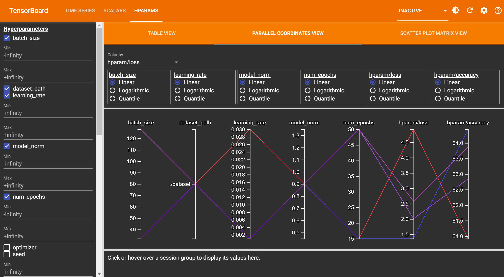

# Solution details lab 6

1. Solved tasks:
- implementing conv2d by hand and testing -> see `conv2d_test.py`
- scripting/tracing model (`pipeline.py`, configuration in `main.py::compare_scripted_traced_and_base_model`) and comparison
AVG running time for scripted vs base 161s vs 167s for defined model, 5 epochs.
- LaTeX report in `report.pdf`
- Graphic validation accuracy on test data:



2. Additional info:
- obtained 0.65 accuracy on test set
- Weight and Biases latest runs: [here](https://wandb.ai/kenr123/lab7assignment6?workspace=user-zero6305)
- Tensorboard logs available locally in `tensorboard_logs_out/`: train and eval folders

```tensorboard --logdir .\tensorboard_logs_out\eval```
```tensorboard --logdir .\tensorboard_logs_out\train```


