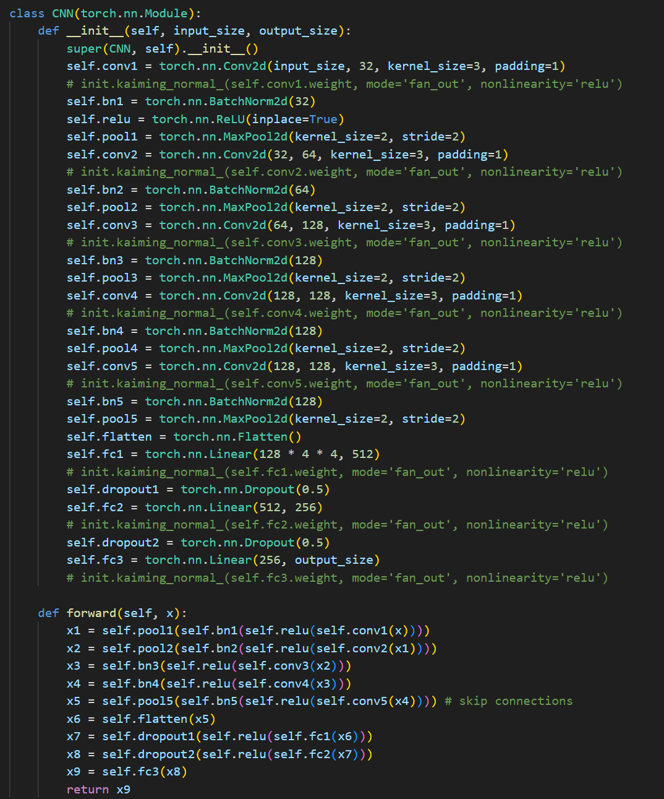
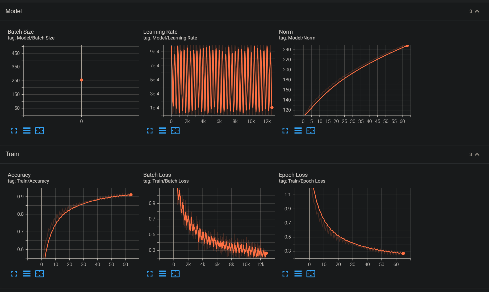
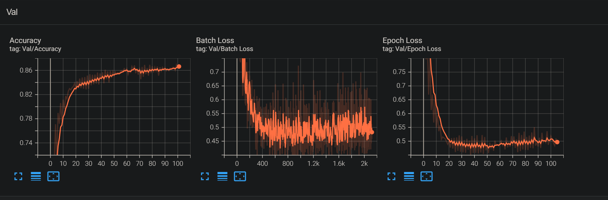
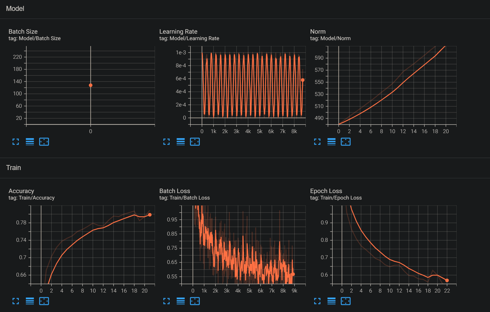
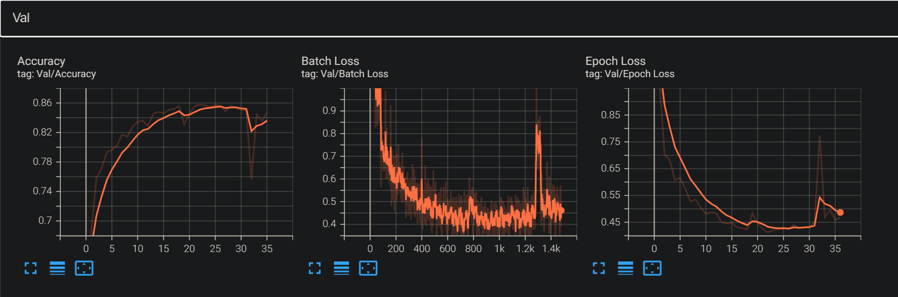
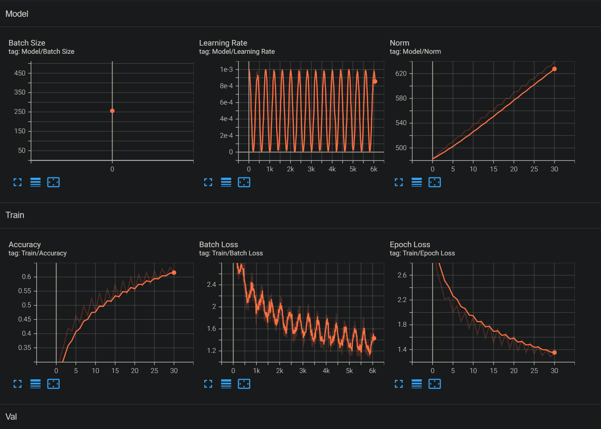
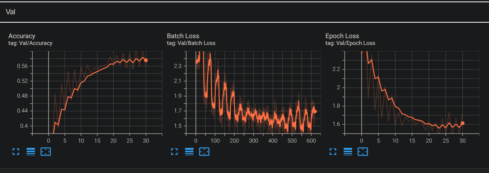

## Solution

CIFAR dataset transforms:
- Normalize the RGB images;
- RandAugment in order to augment the dataset and prevent overfitting;

The model `CNN` is composed of:

    - 5 BatchNormalized Convolutions: 3 MaxPooled and 2 Vanilla;
    - Flatten layer;
    - Linear layers: 2048 - 512 - 256 - 10;

    - the activation function is ReLU;
    - there is dropout inside the Linear Linear;

The wandb hypertuning results can be found here: https://wandb.ai/pricoptudor/Homework6_Solution

Tensorflow log files are attached and labeled in the Solution folder.

CNN on CIFAR10:

Transfer Learning on CIFAR10:

Transfer Learning on CIFAR100:

The expected number of points:

- Conv2d layer by hand: 4p;
- Achieve close to 90% accuracy on CIFAR10 without pretrained model: ?p;
- Achieve close to 90% accuracy on CIFAR10 using Transfer Learning: ?p;
- Achieve close to 60% accuracy on CIFAR100 using Transfer Learning: ?p;