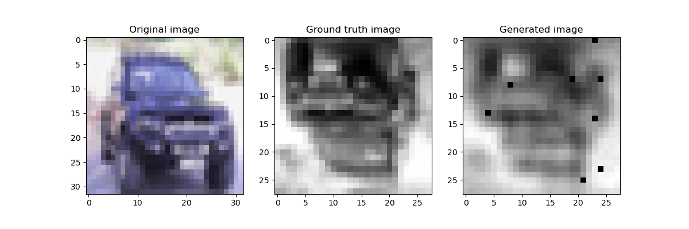
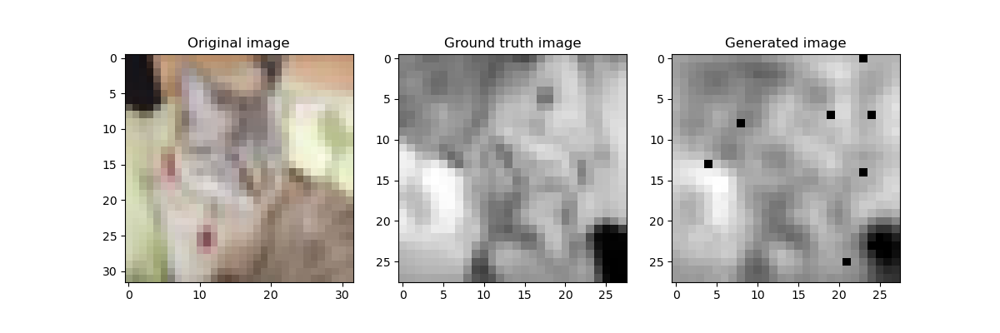

# Homework 7 - Convolutional neural networks

## Abstract

This solution contains a Convolutional Neural Network model that performs the following transformations:
- resizing from `32x32` to `28x28`
- grayscaling
- vertical flipping
- horizontal flipping

Except for the resizing, the model is taught to perform these transformations without knowing what the operations are beforehand.

## Setup

The project requires that the packages from the `requirements.txt` file to be installed.

```sh
$ pip install -r requirements.txt
```

## Running

In order to train the model, the following command can be used:

```sh
$ ./run.sh
```

In order to run the model using preexistent weights and biases, the following command can be used:

```sh
$ ./run_inference.sh
```

## Model

The model contains:
1. 2 Convolutional layers
1. 1 Max pooling 2D layer
1. 2 Fully-connected layers

Each convolutional layer goes through a MaxPooling2D pooling function. The result of these layers go through the fully-connected layers.

## Results

### Outputs

Since the outputs of this model are images, they can be viewed more easily. Some results would be the following:




The network seems to perform the best on images with lots of straight edges, such as cars, planes and boats. When applied on animals, the images are a bit harder to understand:




The best result achieved from the 10 extracted outputs seems to be the following one:


The model seems to output blurry images and some very easy-to-be-seen artifacts, artifacts that are noticeable in each of the outputs in the exact same place. The artifacts did not disappear when retraining the model.

## Losses and accuracies

During training, the following losses and accuracies were observed:

| Run | Optimiser | Learning rate | Batch size | Epochs | Precision* | Best validation loss | Best validation accuracy | Output |
| - | - | - | - | - | - | - | - | - |
| 1 | Adam | `0.001` | `64` | `25` | `+- 0.05` | `1.85` | `52.51%` | [Ref weights file](./data/exports/1701617034023604121.pt) |
| 2 | Adam | `0.001` | `64` | `50` | `+- 0.05` | `0.99` | `62.32%` | [Ref weights file](./data/exports/1701638102504962984.pt) |
| 3 | Adam | `0.001` | `64` | `50` | `+- 0.05` | `0.99` | `62.32%` | [Ref weights file](./data/exports/1701638102504962984.pt) |

\* Precision example: Predicted pixel is of intensity `0.82` and should be of intensity `0.8`. If intensity is `+- 0.05`, then the predicted pixel is considered accurate due to `0.82` being between \[`0.75`, `0.85`\].

## Timings

The model has achieved the following timings on the following constraints:

| Run | Device | Timing for transformations | Timings for model |
| - | - | - | - |
| 1 | `CPU` | `1.1458s` | `1.2898s` | 
| 2 | `CPU` | `0.9764s` | `1.2944s` | 
| 3 | `CPU` | `0.9786s` | `1.1745s` | 
| 4 | `CPU` | `0.9837s` | `1.2515s` | 
| 5 | `CPU` | `0.9729s` | `1.3458s` |

| Run | Device | Timing for transformations | Timings for model |
| - | - | - | - |
| 1 | `CUDA` | `1.5567s` | `0.4800s` | 
| 2 | `CUDA` | `1.5094s` | `0.4755s` | 
| 3 | `CUDA` | `1.5700s` | `0.4562s` | 
| 4 | `CUDA` | `1.5671s` | `0.5263s` | 
| 5 | `CUDA` | `1.5739s` | `0.4927s` | 

**LEGEND**: `CPU` = My laptop's Intel Core i7 1260p, `CUDA` = A rented server with 1 x RTX A5000

Changing the model size (larger convolutions, smaller convolutions, larger kernel sizes and larger strides for maxpool, smaller sizes for the fully-connected layers) did not yield any better results:

| Run | Device | Change | Timing for transformations | Timings for model |
| - | - | - | - | - |
| 1 | `CPU` | `self.fc1 = Linear(64 * 36, 256)` <br> `self.fc2 = Linear(256, 28 * 28)` | `0.9764s` | `1.2944s` | 
| 2 | `CPU` | `self.fc1 = Linear(64 * 36, 128)` <br> `self.fc2 = Linear(128, 28 * 28)` | `0.9915s` | `1.2078s` | 
| 3 | `CPU` | `self.conv1 = Conv2d(3, 64, kernel_size=3)` <br> `self.conv2 = Conv2d(64, 128, kernel_size=3)` <br> `self.pool1 = MaxPool2d(kernel_size=3, stride=3, padding=0)` <br> `self.fc1 = Linear(512, 256)` <br> `self.fc2 = Linear(256, 28 * 28)` | `1.007s` | `1.5796s` | 

## Grading

I consider I have performed the following in this project:

| Point | Point name abstract | Grading | My grading | Motivation |
| - | - | - | - | - |
| 1 | Create a model that is able to do the transformations | 3p | 3p | I have achieved this as per the examples above |
| 2 | Use a suitable loss function for training | 2p | 2p | I have performed this and the motivation can be found in the LaTeX document |
| 3 | Use early stopping as a stopping criteria for the training | 2p | 2p | I have performed this in my `model_trainer.py` file. The motivation can be found in the LaTeX document |
| 4 | After training the model, include at least 5 images generated by your model in the LaTeX document and compare them with the ground truth | 1p | 1p | The motivation can be found in the LaTeX document |
| 5 | Benchmark the model using the ”test inference time” with different parameters | 2p | 1p | I could find some combinations that were faster on GPU than on CPU, but none of my variants were faster on CPU than the pure transformations |